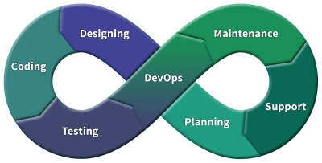

# DevOps-Java

Small tutorial for DevOps and Java

# Steps

1.Setting the production environment.
- [x] [Virtual Box](http://www.virtualbox.org)
- [ ] [Vagrant](https://www.vagrantup.com/downloads.html)

## [Book on Google Books](https://books.google.com.br/books?id=Cm2CCwAAQBAJ)
